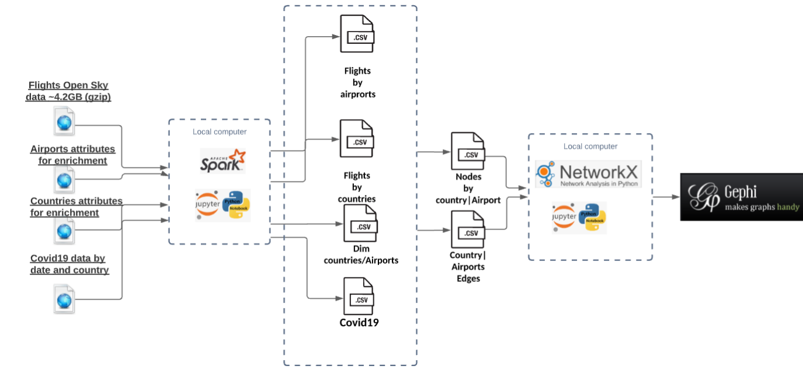

# tau-network-science
This repo is for project that was done as part of Complex networks course at TAU.

In this project we analyze flights during Covid19 period from the graph prespective.

### Directory sturcture

    .
    ├── current_notebooks                   # up-to-date jupiter notebooks with the code
    ├── data                    
    ├── doc                                 # documents
    ├── gephi_graphs                        # ready gephi graphs
    ├── images                    
    ├── networkx_graphs                     # graphs from networkx that are ready for gephi visualization
    ├── old_notebooks
    ├── Complex networks - project.pdf      # project report
    ├── README.md
    └── requierments.txt

### Project report 
Project report can be found [here](https://github.com/SolOlga/ComplexNetworks_project/blob/master/Complex%20networks%20-%20project.pdf)
